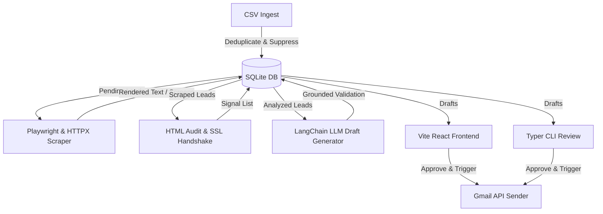

# Agent Handoff & Project Transition Log (`agents.md`)

This document is designed for AI coding agents and developers to quickly understand the current state, architecture, design decisions, and operating procedures of the **Website-Audit Sales Automation** system.

---

## 1. Project Overview & Architecture
This platform automates a highly personalized B2B cold email sales funnel by auditing prospective lead websites.
The architecture is structured as follows:



*   **Backend Core:** Python 3.14 + FastAPI + SQLModel/SQLAlchemy + SQLite.
*   **CLI Layer:** Typer CLI (`src/main.py`).
*   **Web API Layer:** FastAPI (`src/api/main.py`).
*   **Frontend UI:** Vite + React + TypeScript + Tailwind CSS v4 (`frontend/`).

---

## 2. Completed Milestones & Feature Registry

### Core Foundation & CSV Ingest
*   **Database Schema (`src/db.py`):** Models for `Lead`, `Scrape`, `Analysis`, `Email`, `Suppression`, `Event`, `Job`.
*   **Ingestion Pipeline (`src/core/ingest.py`):** Parses lead CSV rows, normalizes URLs, validates email syntaxes, checks against suppressions, and inserts unique pending leads.

### Robust Fallback Scraper (`src/core/scrape.py`)
*   **Playwright (Primary):** Headless Chromium crawls pages and saves screenshots to `data/screenshots/`. Fast load times are enforced by blocking heavy resources (`image`, `media`, `font`).
*   **HTTPX GET (Secondary Fallback):** If Chromium times out or hits SSL issues, the system automatically falls back to an HTTPX request.
*   **HTTPS to HTTP Downgrade Fallback:** If TLS handshake / cipher negotiation fails (e.g. `alerttechs.com`), the HTTPX client falls back to insecure HTTP.
*   **Politeness Coordination:** Custom semaphore and queue rate limiting limit domain hits based on configuration.

### HTML Auditing & Signal Engine (`src/core/analyze.py` / `src/core/service_map.py`)
*   **Local HTML Checks:** Inspects viewport meta, meta titles, descriptions, contact forms, and analytics tags (Google Analytics, GTM, etc.).
*   **Broken Links Sampler:** Validates internal hyperlinks with HEAD requests in parallel to log broken counts.
*   **Google PageSpeed Insights Client (`src/integrations/pagespeed.py`):** Fetches Lighthouse performance metrics. If the API key is missing or blocked (e.g. returns 403/400), it falls back to conservative defaults without failing the analysis.
*   **SSL Handshake Verifier:** A low-level socket SSL handshake check that flags weak cipher suites or missing certificates as signals in cold email copywriting.
*   **Service Mapping Signal Grouping:** Instead of discarding secondary findings that map to the same service (e.g., both mobile layouts and SSL security map to "Full-stack design"), the engine groups and joins them using a semicolon. This provides the LLM with all findings combined in the evidence list.

### Grounded LLM Generation (`src/core/generate.py` / `src/llm/`)
*   **LangChain Integration:** Uses ChatOpenAI/ChatAnthropic based on `.env` settings.
*   **Grounding Validator (`src/llm/validate.py`):** Compares generated cold email claims against audited signals. Fails the validation and runs a self-correction retry loop if claims are not grounded.
*   **CAN-SPAM Compliance:** Appends deterministic footers containing physical addresses and unsubscribe links.

### Mailing Layer (`src/core/send.py` / `src/integrations/`)
*   **Gmail OAuth client:** Securely handles authentication via `./secrets/gmail_oauth.json` and `./secrets/gmail_token.json`.
*   **Safety Guards:** Enforces a daily send cap (default 30) and performs a real-time suppression check right before dispatch.
*   **Lazy Sender Initialization:** The Gmail API sender client is only initialized during real email runs. This enables dry-run sending audits to execute immediately and complete in the background without prompting for interactive Google OAuth codes.

### Background Job Runner & SSE (`src/api/jobs.py` / `src/api/main.py`)
*   **Async Job Orchestration:** Background tasks run via FastAPI BackgroundTasks, tracking progress states (done/total) and logging statuses.
*   **Unified Pipeline Execution:** Supports a composite `pipeline` job type executing website scraping, local and external analysis, and email generation consecutively. Individual stages report descriptive text updates alongside numerical values.
*   **Real-time Event Streaming:** Streams progress and step logs to clients using Server-Sent Events (SSE).
*   **Dashboard Quick Actions:** Highlighting the new glowing "Run Entire Pipeline" autopilot button that schedules the composite job, automatically opening the real-time logging viewport.


---

## 3. Important Windows Platform Constraints & Bugfixes

### The Event Loop NotImplementedError (CRITICAL)
*   **Constraint:** Playwright's async driver on Windows relies on the `ProactorEventLoop` to manage subprocesses. Uvicorn running with `--reload` switches the loop policy to `SelectorEventLoop`, causing immediate crashes on Playwright actions.
*   **Solution:** 
    1. Always run Uvicorn **without** the `--reload` flag in development on Windows:
       ```powershell
       .venv\Scripts\uvicorn src.api.main:app --host 127.0.0.1 --port 8000
       ```
    2. We explicitly set the Windows Proactor loop policy in the entrypoints:
       ```python
       if sys.platform == "win32":
           asyncio.set_event_loop_policy(asyncio.WindowsProactorEventLoopPolicy())
       ```

### Variable Scope NameErrors Fixed (May 31, 2026)
*   **Fix:** Resolved a bug where `scraped_pages` and `rendered_text_parts` were referenced in scraper exception blocks and fallback pipelines but only initialized inside the Playwright `try` scope. They are now initialized at the start of `scrape_single_lead` to ensure all fallback branches execute cleanly.

---

## 4. How to Run & Verify the Project

### Database Setup
The database is located at `data/leads.db`. 
*   To clean and reset the database schema and sample folders, run:
    *   Windows: `.\reset_project.ps1`
    *   Unix: `sh reset_project.sh`

### CLI Commands (`.venv\Scripts\python -m src.main [command]`)
*   `status`: Show database statistics.
*   `ingest --csv <path>`: Load leads from a CSV.
*   `scrape`: Scrape pending leads.
*   `analyze`: Analyze scraped content.
*   `generate`: Draft cold emails.
*   `review`: Review generated drafts inside the terminal.
*   `send`: Dispatch approved cold emails.

### Running Backend API & Frontend UI
1.  **Start FastAPI Backend:**
    ```powershell
    .venv\Scripts\uvicorn src.api.main:app --host 127.0.0.1 --port 8000
    ```
2.  **Start React Frontend:**
    ```powershell
    cd frontend
    npm run dev
    ```

### Test Suite
Run backend tests to verify everything is green:
```powershell
.venv\Scripts\pytest
```

---

## 5. Active Database Status Summary
As of May 31, 2026, the database lead funnel status is:
*   **`analyzed` / `drafted`**: 5 leads (`leichthaus.com`, `babson.edu`, `alerttechs.com`, `californiapools.com`, `mythreesonspainting.com`).
*   **`failed`**: 1 lead (`mossreplacementwindows.com` due to a hosting provider `403 Forbidden` block).
