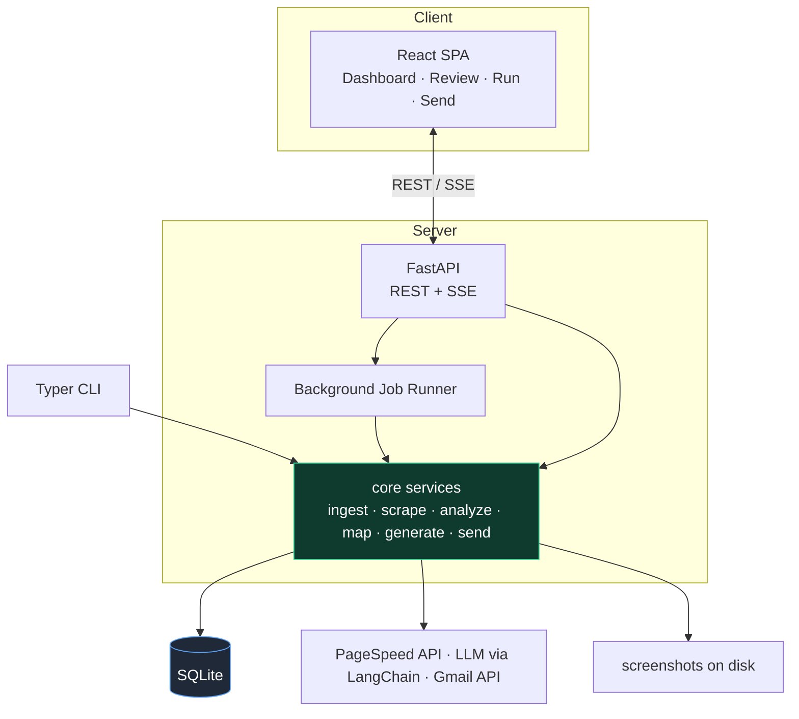
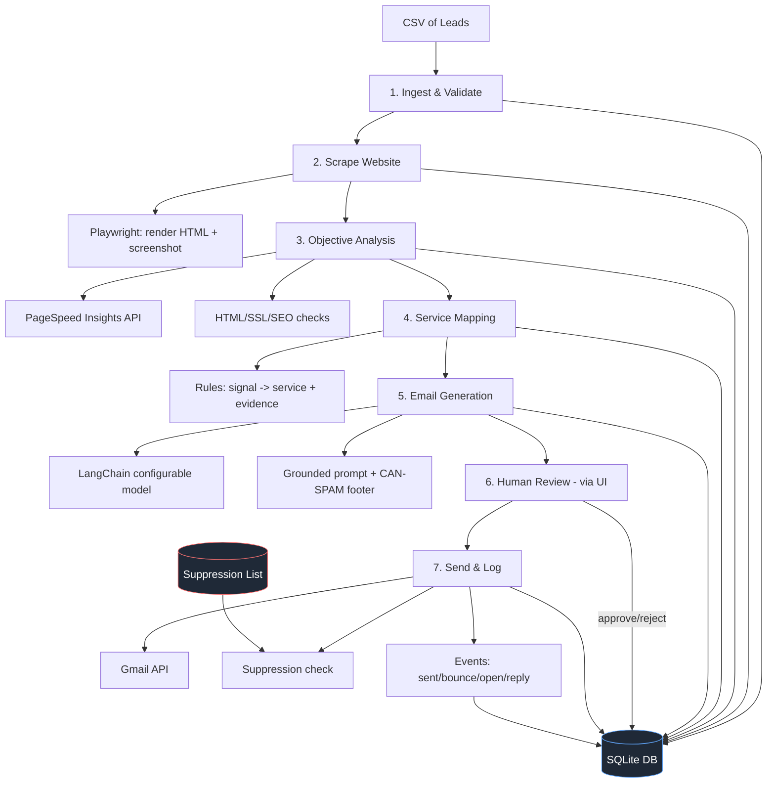
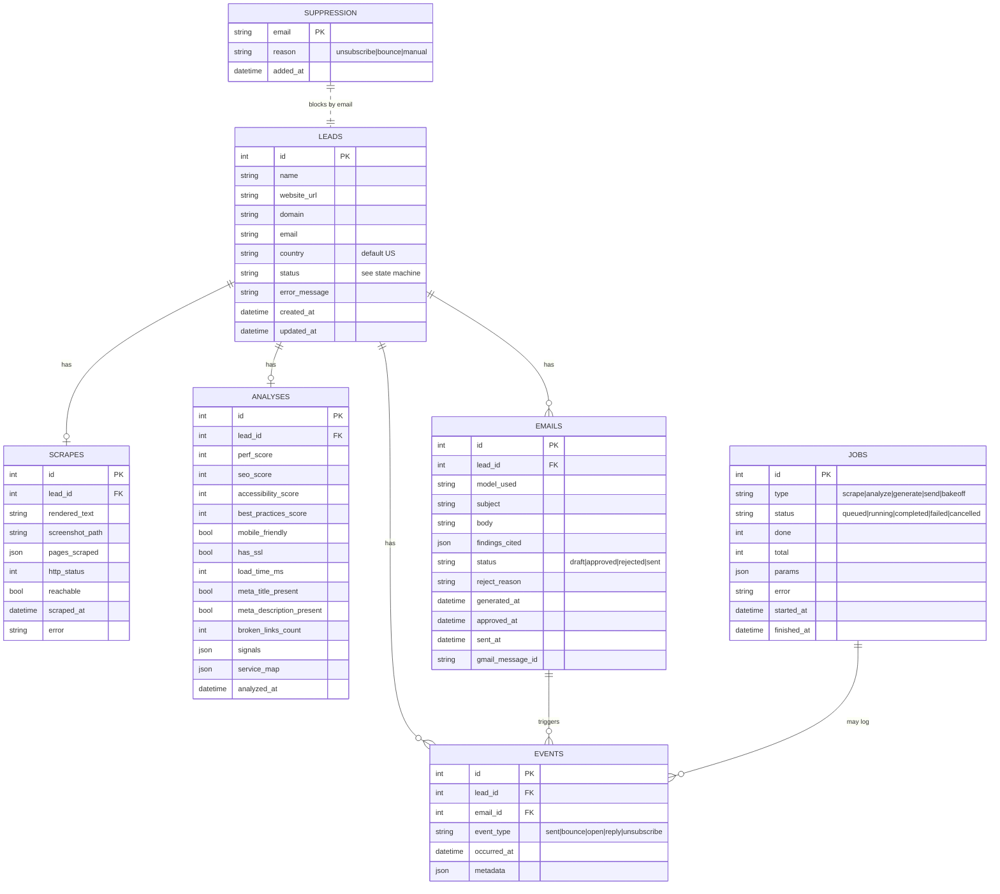
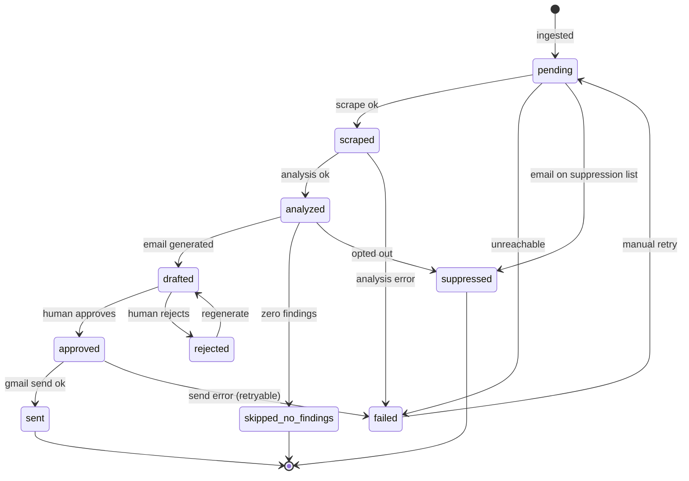
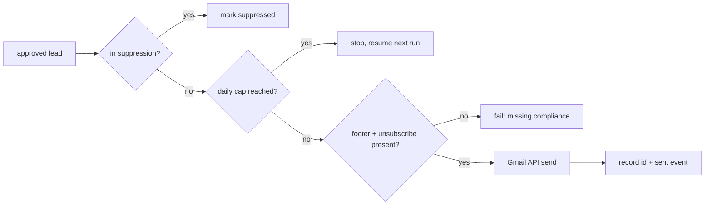
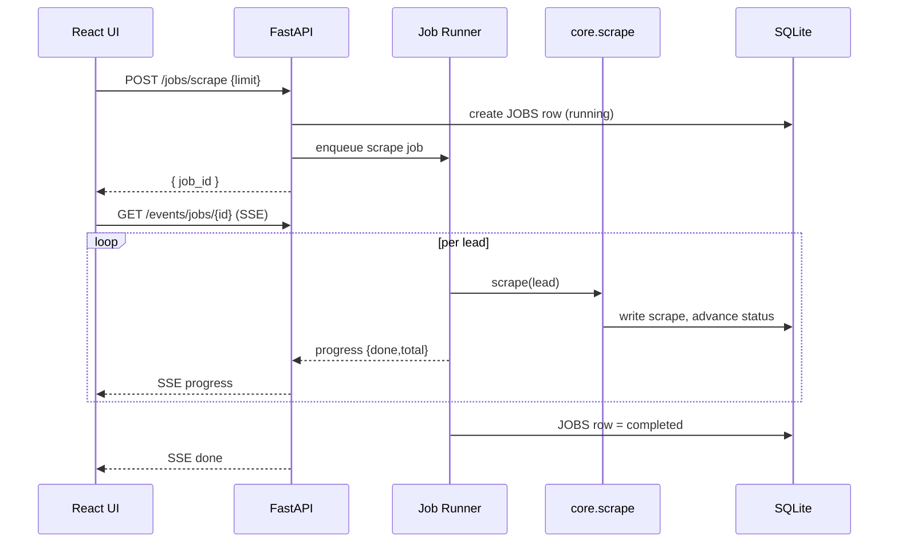
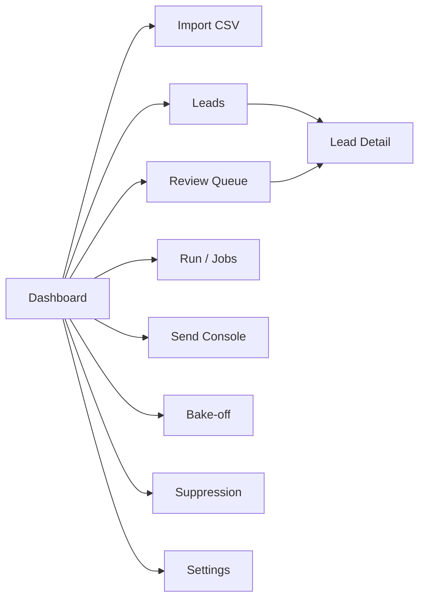

# Website-Audit Sales Automation — Design & Build Specification

**Version:** 1.2
**Target audience:** Agentic coding tools (e.g. Claude Code) and human engineers
**Scope:** US recipients only (CAN-SPAM compliance). Gmail for the testing phase; pluggable sending layer for scale. **Web UI + CLI**, both driving a shared core.

---

## 1. Purpose & Overview

Build a pipeline that ingests a CSV of leads (name, business website, email), scrapes each website, measures objective quality signals, maps weaknesses to the services we sell, and generates a personalized cold email citing those specific findings. Emails are human-reviewed (in the web UI) during the testing phase, then sent via the Gmail API. The same pipeline is operable from a **web dashboard** and a **CLI**.

**Services we sell (used to frame every email):**
- Full-stack design
- CRM
- Data analytics
- Full-stack data solutions

**Core design principle — Grounded claims only.** Every improvement cited in an email MUST be backed by an objectively measured signal (a Lighthouse score, a missing meta tag, a failing SSL check, etc.). The LLM is never allowed to invent a weakness. A confidently wrong critique permanently burns a lead.

### 1.1 Goals
1. Process thousands of US leads in resumable batches.
2. Produce credible, specific, personalized emails (not templated spam).
3. Keep the model provider swappable (LangChain) so models can be A/B compared and changed without code edits.
4. Bake CAN-SPAM compliance into every outgoing email.
5. Provide a web UI for importing leads, monitoring progress, reviewing/approving emails, and controlling sends — with the CLI retained for automation.

### 1.2 Non-Goals (v1)
- No EU/India recipients (no GDPR/DPDP handling).
- No multi-inbox rotation, domain warm-up, or dedicated sending infra (Phase 2).
- No reply-handling/auto-responder or CRM write-back (future).
- No multi-tenant accounts/role-based auth (single-user local tool in v1).
- No JS anti-bot evasion / proxy rotation (Phase 2 if needed).

---

## 2. System Architecture

The pipeline logic lives in a **shared `core` service layer**. Both the CLI and the FastAPI backend call `core`; the React UI talks to the backend over REST + Server-Sent Events. Long-running stages run as background jobs so the UI never blocks.

### 2.1 Application architecture



### 2.2 Pipeline data flow



Each stage is an independent, idempotent step that reads leads in a given status, processes them, writes results, and advances the status. A crash mid-batch loses nothing — re-running (from CLI or UI) resumes from the last incomplete status.

---

## 3. Tech Stack

| Concern | Choice | Notes |
|---|---|---|
| Language (backend) | Python 3.11+ | Pipeline, core, API |
| Scraping/rendering | Playwright (Chromium) | Renders JS-heavy sites; captures screenshot |
| HTML parsing | BeautifulSoup4 + lxml | Meta tags, links, headings |
| Objective metrics | Google PageSpeed Insights API | Free; Lighthouse perf/SEO/a11y/best-practices |
| HTTP | httpx | Async; SSL/redirect inspection |
| LLM access | LangChain (`init_chat_model`) | Provider-agnostic; configurable at runtime |
| LLM providers | `langchain-anthropic`, `langchain-openai`, `langchain-google-genai` | Install per provider tested |
| Data store | SQLite (via SQLAlchemy) | Single-file, resumable, zero infra |
| Validation | Pydantic v2 | Typed rows, config, LLM output, API schemas |
| Email send | Gmail API (`google-api-python-client`, OAuth2) | Behind an `EmailSender` interface |
| **Backend API** | **FastAPI + Uvicorn** | REST + SSE over the same core + DB |
| **Background jobs** | **In-process async worker + `jobs` table (v1); RQ + Redis (scale)** | Long stages run async; progress tracked |
| **Realtime** | **SSE (`sse-starlette`)** | Stream job progress to the UI |
| **Frontend** | **React 18 + Vite + TypeScript** | SPA |
| **UI styling** | **Tailwind CSS** | Follow good design practice; clean, dense data UI |
| **Data fetching** | **TanStack Query** | Caching, polling, mutations |
| **Charts/gauges** | **Recharts** | Funnel + Lighthouse score gauges |
| Config | YAML + `.env` | Config in YAML, secrets in `.env` |
| CLI | Typer | Subcommand per stage + full-run |
| Logging | structlog | Structured JSON logs |
| Retries | tenacity | Exponential backoff on transient errors |
| Testing | pytest + (frontend) Vitest | Unit, dry-run integration, API |

> **Model IDs version frequently — verify the exact current string per provider.** Reasonable defaults: `claude-sonnet-4-6` (Anthropic), `gpt-5.4-mini` (OpenAI), Gemini Flash via `langchain-google-genai`. Default model: **`claude-sonnet-4-6`**.

> **Frontend is committed to React + Vite + TypeScript + Tailwind** (with shadcn/ui components) for a polished, product-grade look and full layout control. Do not substitute a Python-native UI framework. Follow the design guidance in §8.6.

---

## 4. Data Model



### 4.1 Lead Status State Machine



A stage only picks up leads in its expected input status, which makes every stage idempotent and the whole run resumable.

---

## 5. Pipeline Stages (Detailed)

### Stage 1 — Ingest & Validate
**Input:** CSV path / upload. **Output:** `leads` rows with `status='pending'`.
- Configurable column mapping for `name`, `website`, `email`; tolerate header variants.
- Normalize `website_url` (add `https://`, strip tracking params/fragments, lowercase host); extract `domain`.
- Validate email syntax; invalid → `failed` + reason.
- Deduplicate by `email` and by `domain`.
- Check `email` against `SUPPRESSION`; if present → `suppressed`.
- Set `country='US'`.
- **Edge cases:** empty/duplicate rows, malformed URLs, personal mailboxes (flag), non-US TLDs (log).

### Stage 2 — Scrape
**Input:** `pending`. **Output:** `scrapes` row; advance to `scraped`/`failed`.
- Playwright (Chromium, headless): navigate homepage, wait for network idle (cap `timeout_ms`), capture rendered text + full HTML + full-page screenshot to `data/screenshots/{lead_id}.png`.
- Discover/fetch up to `max_pages` internal links matching `about|services|contact|pricing`.
- Respect `robots.txt`; global `scrape_concurrency` semaphore + per-domain politeness delay.
- Transient failures → retry w/ backoff; hard failures → `failed` + reason.
- **Edge cases:** infinite scroll, parked domains, headless-blocking sites (flag), oversized pages (truncate to `max_text_chars`).

```mermaid
sequenceDiagram
    participant O as Orchestrator/Job
    participant S as Scraper
    participant W as Website
    participant DB as SQLite
    O->>S: scrape(lead)
    S->>W: GET robots.txt
    W-->>S: rules
    S->>W: render homepage (Playwright)
    W-->>S: HTML + screenshot
    S->>W: fetch key subpages
    W-->>S: HTML
    S->>DB: write scrape row, status=scraped
    Note over S,DB: timeout/5xx -> retry; hard fail -> failed
```

### Stage 3 — Objective Analysis
**Input:** `scraped`. **Output:** `analyses` row (metrics + `signals`); advance to `analyzed`.
- **PageSpeed Insights** (mobile): perf/seo/accessibility/best-practices scores, `load_time_ms`, `mobile_friendly`. Needs `PAGESPEED_API_KEY`; rate-limit (~240/min, 25k/day).
- **Local HTML checks:** meta title/description, `<h1>`, viewport meta, structured data, image `alt` coverage.
- **SSL:** valid cert, HTTP→HTTPS redirect → `has_ssl`.
- **Broken links:** HEAD-check a sample → `broken_links_count`.
- Compose `signals` JSON: `[{key, value, severity, threshold}]`.
- **Edge cases:** PageSpeed error on blocked pages → mark unavailable, never fabricate.

### Stage 4 — Service Mapping
**Input:** `analyses.signals`. **Output:** `analyses.service_map` JSON. **No LLM — this is the grounding layer.**

| Signal condition | Mapped service | Evidence string template |
|---|---|---|
| `perf_score < 50` or `load_time_ms > 4000` | Full-stack design | "Homepage loads in {load_time_ms} ms (Lighthouse performance {perf_score}/100)" |
| `mobile_friendly == false` / no viewport | Full-stack design | "Not mobile-optimized (no responsive viewport detected)" |
| `seo_score < 70` / missing meta | Data analytics / design | "Missing {meta_gap}; SEO score {seo_score}/100" |
| No contact form / mailto-only | CRM | "No lead-capture form found; inquiries rely on a raw email link" |
| No analytics tag / fully static | Data analytics | "No visitor analytics or personalization detected" |
| Evident manual workflow / no integrations | Full-stack data solutions | "Manual processes visible; no system integrations detected" |
| `has_ssl == false` | Full-stack design | "No valid SSL certificate (served over HTTP)" |

Select top `max_findings` (default 3) by severity. Zero findings → `skipped_no_findings`; **never generate an email with no grounded findings.**

### Stage 5 — Email Generation
**Input:** `analyzed` w/ ≥1 finding. **Output:** `emails` `status='draft'`; lead → `drafted`.
- Build prompt from template (§6.2) injecting lead/business/findings/services/CTA + footer.
- Call LangChain configurable model; parse subject+body via Pydantic.
- **Guardrail:** post-gen validator checks every concrete claim maps to a `findings_cited` entry; unsupported claim → regenerate (max N) or flag for review.
- Append compliant footer (physical address + unsubscribe link) deterministically — never rely on the model.

### Stage 6 — Human Review (via Web UI)
**Input:** `drafted`. **Output:** `approved`/`rejected`. See §8.4 Review Queue. Mandatory in testing mode. CLI fallback retained.

### Stage 7 — Send & Log
**Input:** `approved`. **Output:** `sent` + `EVENTS`.
- **Pre-send checks (every email):** not in `SUPPRESSION`; footer present; valid unsubscribe link; daily cap not exceeded.
- Send via `EmailSender` (Gmail in Phase 1); record `gmail_message_id` + `sent` event.
- **Throttling:** `daily_send_limit` (default **30** for Gmail testing) + per-message delay; stop cleanly at cap, resume next run.
- **Bounce/unsubscribe → `SUPPRESSION`** + events.
- `--dry-run` renders/logs everything, sends nothing.



---

## 6. LLM Integration (LangChain)

### 6.1 Configurable model
Use `init_chat_model` with runtime-configurable `model`/`model_provider` (never `configurable_fields="any"` — that would allow `api_key`/`base_url` overrides).

```python
from langchain.chat_models import init_chat_model

def build_llm(default_model: str, temperature: float):
    return init_chat_model(
        default_model,                                  # e.g. "claude-sonnet-4-6"
        configurable_fields=("model", "model_provider"),
        temperature=temperature,
        max_retries=3,
    )
# swap at call time, no code change:
# llm.invoke(prompt, config={"configurable": {"model": "gpt-5.4-mini", "model_provider": "openai"}})
```

### 6.2 Prompt template (grounded generation)
1. Write one short B2B cold email.
2. ONLY reference findings in `FINDINGS`; introduce no other claim about the site.
3. Cite 2–3 findings, each tied to the relevant service we offer.
4. One clear CTA (configurable).
5. Output strict JSON `{"subject": "...", "body": "..."}` — no preamble/markdown.
6. Tone: helpful, specific, non-salesy; ≤ ~150 words.
Inject `{lead_name}`, `{business}`, `{findings}`, `{our_services}`, `{cta}`.

### 6.3 Output validation
Parse JSON with Pydantic (`EmailDraft`); run `validate_grounding(body, findings_cited)`; retry up to `max_generation_attempts`, else flag for review.

### 6.4 Model bake-off
`bakeoff` (CLI + UI): sample N analyzed leads, generate across a model list, emit side-by-side comparison (model, subject, body, latency, token cost) to pick the production model.

> Cost note: full run is tens of dollars at a few thousand leads — optimize for quality, not token price. LangChain `.batch()` is concurrent calls, not the providers' discounted async Batch API; the lost discount is negligible at this scale.

---

## 7. Compliance (US / CAN-SPAM)

Baked into **every** outgoing email (deterministically):
1. Truthful headers & sender identity; no deceptive subject lines.
2. Physical postal address in footer (from config).
3. Working, easy opt-out (unsubscribe link).
4. Honor opt-outs promptly — unsubscribe → `SUPPRESSION` immediately; never re-email (checked at ingest + pre-send).
5. B2B addresses only — skip obvious personal mailboxes where detectable.

`SUPPRESSION` is the single source of truth, checked at ingest (Stage 1) and pre-send (Stage 7). **The UI must block enabling real sends until physical address + unsubscribe URL are configured** (§8.5).

---

## 8. Web Application & UI

### 8.1 Approach
A web dashboard over the same pipeline. **Refactor pipeline stages into a `core` service layer** exposing pure functions/services; the CLI and the FastAPI API are thin wrappers over `core`, and the React UI consumes the API. Long-running stages execute as background jobs with progress streamed to the UI. UI and CLI share one DB and produce identical results.

### 8.2 Backend API (FastAPI)
Reuses `core` + the same SQLite DB. REST + SSE.

| Method & path | Purpose |
|---|---|
| `POST /leads/import` | Upload CSV → ingest (returns validation summary) |
| `GET /leads` | List/filter by status, search by domain/email, paginate |
| `GET /leads/{id}` | Full detail: scrape, screenshot URL, analysis, service_map, email |
| `POST /jobs/scrape` / `analyze` / `generate` | Start stage as background job `{limit?}` → `{job_id}` |
| `POST /jobs/send` | Start send job `{dry_run, limit}` |
| `POST /jobs/bakeoff` | Start bake-off `{sample, models}` |
| `GET /jobs` / `GET /jobs/{id}` | Job list / status + progress |
| `POST /jobs/{id}/cancel` | Cooperative cancel |
| `GET /events/jobs/{id}` | **SSE** progress stream |
| `GET /review/queue` | Drafts awaiting review |
| `POST /emails/{id}/approve` / `reject` | Approve / reject `{reason}` |
| `PUT /emails/{id}` | Edit subject/body |
| `POST /emails/{id}/regenerate` | Regenerate draft |
| `GET /send/status` | Daily-cap progress, approved count |
| `GET/POST /suppression`, `DELETE /suppression/{email}` | Manage suppression list |
| `GET/PUT /config` | Read/update non-secret settings; secrets shown as configured/not-configured only |
| `GET /bakeoff/{id}` | Bake-off comparison results |
| `GET /stats` | Funnel counts by status |
| `GET /screenshots/{lead_id}` | Static screenshot serve (read-only) |

All endpoints validated with Pydantic schemas. Errors return structured `{code, message}`.

### 8.3 Background jobs & progress
- v1: in-process async worker; each job writes a `JOBS` row (`type/status/done/total/params/error`).
- Stage jobs iterate leads, update `done/total`, and push progress over SSE.
- Scale option: swap the worker for **RQ + Redis** behind the same job interface (no API/UI change).
- Jobs are cancellable and resumable (status-gated leads mean a cancelled job just leaves leads in their prior status).



### 8.4 Frontend screens (React)



1. **Dashboard** — funnel counts (pending→sent), recent jobs, daily-send progress bar, quick actions.
2. **Import** — drag-drop CSV, column-mapping preview, validation summary (valid / invalid / dupes / suppressed).
3. **Leads** — table with status filter, domain/email search, pagination, bulk select; row → detail.
4. **Lead Detail** — tabs: Overview (status timeline) · Scrape (rendered text + screenshot) · Analysis (score gauges + signals w/ severity) · Findings (service_map) · Email (draft preview).
5. **Review Queue (primary screen)** — one card per draft: left = website screenshot + the grounded findings/evidence; right = editable subject + body. Actions: **Approve / Reject (with reason) / Edit / Regenerate**. Keyboard shortcuts (A / R / E / →). Shows grounding-validator warnings. Progress "x of y reviewed".
6. **Run / Jobs** — trigger each stage or full run, set limit, dry-run toggle; live SSE progress with a tailing per-lead log; job history + cancel.
7. **Send Console** — daily-cap gauge, approved count, Send / Pause, dry-run; live send log; auto-stops at cap.
8. **Bake-off** — pick sample size + models, run, view side-by-side outputs with cost/latency; "set as default model".
9. **Suppression** — searchable list, manual add/remove with reason, import/export.
10. **Settings** — edit config values (sender identity, physical address, unsubscribe URL, thresholds, caps, CTA, default model). Secrets stay in `.env`, displayed only as configured/not-configured.

### 8.5 UI compliance & safety guardrails
- **Send is disabled** (with an explanatory banner) until `physical_address` and `unsubscribe_base_url` are set in Settings.
- Send Console only ever sends `approved` emails; never bypasses review in testing mode.
- Send button disabled once `daily_send_limit` is reached.
- All destructive actions (delete, bulk reject, suppression remove) require confirmation.
- Screenshots/large text are read-only; long text truncated with expand.
- **Auth:** v1 is a single-user local tool; protect the API with a simple token/basic-auth from `.env`. Real auth (sessions, RBAC) is required before any hosted/multi-user deployment — out of scope for v1.

### 8.6 Frontend design guidance
The UI should read as a polished, product-grade application, not a generic admin template.
- **Component library:** shadcn/ui on top of Tailwind for accessible, consistent primitives (buttons, dialogs, tables, tabs, toasts).
- **Layout:** persistent left sidebar nav + top bar (current job/cap status); content area with comfortable density for data tables.
- **Visual system:** one cohesive theme (light + dark), a single accent color, consistent spacing scale, and clear typographic hierarchy. Avoid default-blue-everything; pick a deliberate palette.
- **Data display:** Lighthouse scores as compact radial/severity gauges (Recharts); the funnel as a horizontal stage bar; status shown via consistent colored badges.
- **Review Queue** is the signature screen — invest the most polish here: a clean two-pane card, readable email typography, obvious primary/secondary actions, and smooth keyboard-driven flow.
- **States:** design explicit empty, loading (skeletons), error, and success states for every screen; never leave a blank panel.
- **Feedback:** toasts for actions, inline validation in Settings, and live progress for jobs (no spinners that hang with no context).

---

## 9. Project Structure

```
sales_automation/
├── pyproject.toml
├── requirements.txt
├── .env.example
├── config.yaml
├── README.md
├── src/
│   ├── main.py                 # Typer CLI (thin wrapper over core)
│   ├── config.py               # YAML + .env -> typed Settings
│   ├── db.py                   # SQLAlchemy engine/session/schema
│   ├── models.py               # Pydantic models (Lead, Scrape, Analysis, EmailDraft, Job, Settings)
│   ├── core/                   # SHARED pipeline services (CLI + API both call these)
│   │   ├── ingest.py
│   │   ├── scrape.py
│   │   ├── analyze.py
│   │   ├── service_map.py
│   │   ├── generate.py
│   │   ├── review.py
│   │   └── send.py
│   ├── llm/
│   │   ├── client.py           # configurable model
│   │   ├── prompts.py
│   │   ├── validate.py         # grounding validator
│   │   └── bakeoff.py
│   ├── integrations/
│   │   ├── pagespeed.py
│   │   ├── gmail_sender.py      # implements EmailSender
│   │   └── sender_base.py       # EmailSender interface (Phase 2 swap point)
│   ├── api/                    # FastAPI backend
│   │   ├── main.py             # app factory, CORS, static screenshots, auth
│   │   ├── deps.py
│   │   ├── jobs.py             # background job runner + JOBS table ops + SSE
│   │   ├── schemas.py          # request/response Pydantic models
│   │   └── routers/
│   │       ├── leads.py
│   │       ├── jobs.py
│   │       ├── review.py
│   │       ├── send.py
│   │       ├── suppression.py
│   │       ├── config.py
│   │       └── stats.py
│   └── utils/
│       ├── logging.py
│       ├── rate_limit.py
│       └── url.py
├── frontend/                   # React + Vite + TypeScript
│   ├── index.html
│   ├── package.json
│   ├── vite.config.ts
│   ├── tailwind.config.js
│   └── src/
│       ├── main.tsx
│       ├── api/                # typed API client + TanStack Query hooks
│       ├── components/         # tables, gauges, cards, dialogs
│       ├── pages/              # Dashboard, Import, Leads, LeadDetail, Review,
│       │                       # Jobs, SendConsole, Bakeoff, Suppression, Settings
│       └── hooks/              # useSSE(jobId), useStats, ...
├── data/
│   ├── leads.db
│   └── screenshots/
└── tests/
    ├── test_ingest.py
    ├── test_service_map.py
    ├── test_grounding.py
    ├── test_send_dryrun.py
    └── test_api.py
```

> `src/core/*` holds all logic. `src/main.py` (CLI) and `src/api/*` (HTTP) are thin and both import `core`. This guarantees CLI and UI behave identically.

---

## 10. Configuration

`config.yaml` (non-secret):

```yaml
csv:
  column_map: { name: name, website: website, email: email }
scrape:
  concurrency: 4
  timeout_ms: 20000
  max_pages: 3
  max_text_chars: 20000
  politeness_delay_ms: 1000
  respect_robots: true
analysis:
  pagespeed_strategy: mobile
  thresholds: { perf: 50, seo: 70, load_ms: 4000 }
  broken_link_sample: 10
service_map:
  max_findings: 3
llm:
  default_model: claude-sonnet-4-6
  default_provider: anthropic
  temperature: 0.4
  max_generation_attempts: 3
email:
  cta: "reply to this email"
  sender_name: "<YOUR NAME>"
  sender_company: "<YOUR COMPANY>"
  physical_address: "<REQUIRED POSTAL ADDRESS>"
  unsubscribe_base_url: "https://<your-unsub-endpoint>/u/"
send:
  provider: gmail
  daily_send_limit: 30
  per_message_delay_s: 20
  dry_run: false
  require_human_review: true
api:
  host: 127.0.0.1
  port: 8000
  cors_origins: ["http://localhost:5173"]
  auth_token_required: true
jobs:
  backend: inprocess        # inprocess | rq
  max_concurrent_jobs: 1
```

`.env` (secrets):
```
ANTHROPIC_API_KEY=
OPENAI_API_KEY=
GOOGLE_API_KEY=
PAGESPEED_API_KEY=
GMAIL_OAUTH_CREDENTIALS=./secrets/gmail_oauth.json
GMAIL_TOKEN_PATH=./secrets/gmail_token.json
API_AUTH_TOKEN=            # required if api.auth_token_required
```

---

## 11. CLI + API (both call `core`)

CLI (automation/cron):
```
python -m src.main ingest --csv leads.csv
python -m src.main scrape  [--limit N]
python -m src.main analyze [--limit N]
python -m src.main generate [--model claude-sonnet-4-6] [--limit N]
python -m src.main review                       # CLI fallback approve/reject
python -m src.main send --approved-only [--limit 30] [--dry-run]
python -m src.main run --all [--dry-run]
python -m src.main bakeoff --sample 20 --models claude-sonnet-4-6,gpt-5.4-mini
python -m src.main status
```

API + UI (interactive):
```
uvicorn src.api.main:app --reload          # backend at :8000
cd frontend && npm run dev                  # UI at :5173 (proxies to :8000)
```

---

## 12. Error Handling & Observability
- **Per-lead isolation:** every stage wraps each lead; failures set `failed` + `error_message`, never abort the batch.
- **Retries:** tenacity backoff for transient errors (network, 429, 5xx); hard errors fail fast.
- **Idempotency:** status-gated stages → re-runs touch only unprocessed leads.
- **Rate limits:** central limiters for PageSpeed and Gmail.
- **Jobs:** every background job is tracked in `JOBS` with progress + error; surfaced in the UI.
- **Logging:** structlog JSON to stdout + file; one line per lead per stage with `lead_id`, stage, outcome, duration.

---

## 13. Testing Strategy
- **Unit:** URL normalization, CSV mapping, service-map rules (table-driven), grounding validator, suppression checks.
- **Grounding test (critical):** a draft asserting a metric not in findings MUST be rejected.
- **Dry-run integration:** full pipeline on fixture sites with `--dry-run`; assert drafts generated, footer present, nothing sent.
- **API tests:** import → list → run job (mocked core) → review approve → send dry-run, via FastAPI test client.
- **Send safety test:** sending to a suppressed address MUST be blocked; sending past daily cap MUST stop.
- **Frontend (Vitest):** API client hooks, Review Queue actions, Settings compliance-blocker logic.

---

## 14. Build Sequence (Milestones)

```mermaid
flowchart LR
    M1[M1 Scaffold+Config+DB+Ingest] --> M2[M2 Scraper]
    M2 --> M3[M3 Analysis+Service Map]
    M3 --> M4[M4 LLM Gen+Grounding+Bake-off]
    M4 --> M5[M5 CLI Review+Send+Suppression]
    M5 --> M6[M6 Core refactor + FastAPI read APIs]
    M6 --> M7[M7 Job runner + stage endpoints + SSE]
    M7 --> M8[M8 React: Dashboard/Import/Leads/Detail/Jobs]
    M8 --> M9[M9 Review Queue + Send Console + Suppression + Settings]
    M9 --> M10[M10 Bake-off UI + polish + e2e dry run]
```



**M1 Foundation** — scaffold, `requirements.txt`, typed Settings, SQLAlchemy schema (incl. `JOBS`), `ingest`. *Done:* CSV → validated `pending` leads, dedup + suppression applied.
**M2 Scraper** — Playwright render+screenshot+subpages, robots+rate-limit, retries. *Done:* `pending`→`scraped`, failures recorded.
**M3 Analysis+Map** — PageSpeed + HTML/SSL/SEO checks + signals + deterministic service-map. *Done:* `scraped`→`analyzed` w/ signals+service_map; zero-finding → skipped.
**M4 Generation** — LangChain configurable model, prompt, Pydantic output, grounding validator, bake-off harness. *Done:* `analyzed`→`drafted` w/ footer; validator rejects unsupported claims; bake-off emits comparison.
**M5 CLI Review+Send** — CLI review, Gmail sender behind `EmailSender`, pre-send compliance+cap checks, suppression, events. *Done:* approved emails send/dry-run, caps enforced, suppressed blocked.
**M6 Core refactor + read APIs** — extract `core`; FastAPI with read-only endpoints (`/stats`, `/leads`, `/leads/{id}`, `/screenshots`). *Done:* funnel + leads viewable over HTTP.
**M7 Jobs + SSE** — background job runner + `JOBS` ops + stage/send/bakeoff endpoints + SSE progress + cancel. *Done:* stages run from API with live progress.
**M8 React core** — Dashboard, Import, Leads, Lead Detail, Run/Jobs with SSE. *Done:* import a CSV and run stages from the browser.
**M9 Review + Send + Settings** — Review Queue (approve/reject/edit/regenerate), Send Console, Suppression, Settings with compliance blockers. *Done:* drafts reviewed and approved emails sent (dry-run) from UI; send disabled until address+unsubscribe set and at cap.
**M10 Bake-off UI + polish** — in-browser model comparison + "set default", empty/error states, e2e dry-run pass. *Done:* models compared in UI; full funnel runs end-to-end resumably.

---

## 15. Acceptance Criteria (System-Level)
1. Re-running any stage (CLI or UI) never double-processes or double-sends.
2. No email is sent without (a) human approval in testing mode, (b) a compliant footer with physical address + working unsubscribe, (c) a passing suppression check.
3. Every claim in every email body maps to a finding in `findings_cited` (grounding validator).
4. Leads with no objective findings produce no email.
5. Daily send cap is never exceeded; runs stop cleanly and resume.
6. The production model can be changed via config/CLI/UI with zero code edits.
7. **CLI and UI operate on the same DB via shared `core` and produce identical results.**
8. **Long-running stages run as background jobs; the UI stays responsive and shows live progress.**
9. **The UI blocks enabling real sends until `physical_address` and `unsubscribe_base_url` are configured.**

---

## 16. Phase 2 Notes (Out of Scope for v1)
Only Stages 6–7 and the auth model change at scale. Swap the Gmail `EmailSender` for a dedicated-domain + multi-inbox + cold-email-platform implementation (rotation, warm-up, throttling, unsubscribe); swap the in-process job runner for RQ+Redis; add real authentication before any hosted/multi-user use. Everything upstream (ingest → scrape → analyze → service-map → generate) and the entire UI are unchanged — keep the `EmailSender` and job interfaces stable so these are drop-in replacements.
