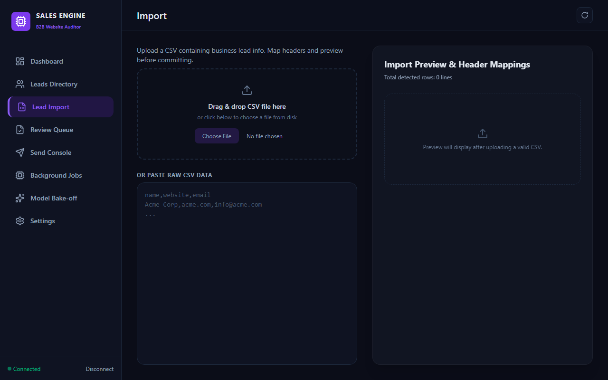
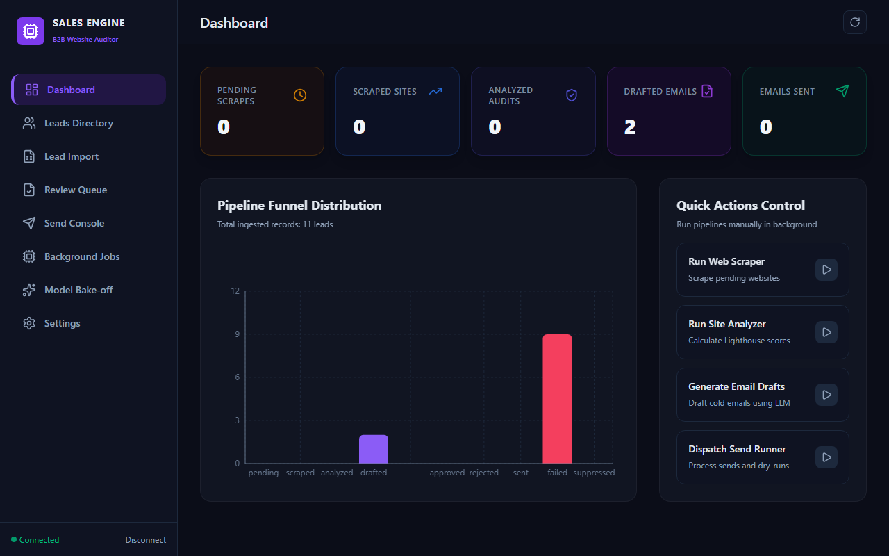
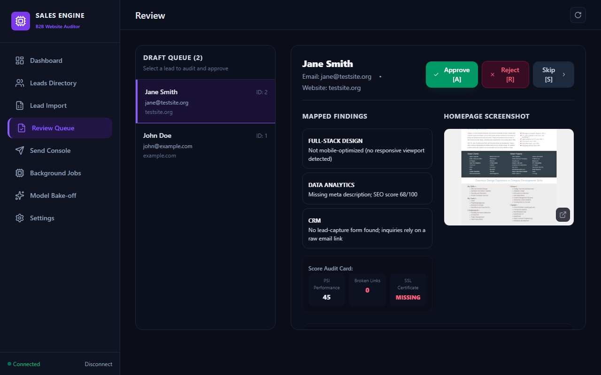
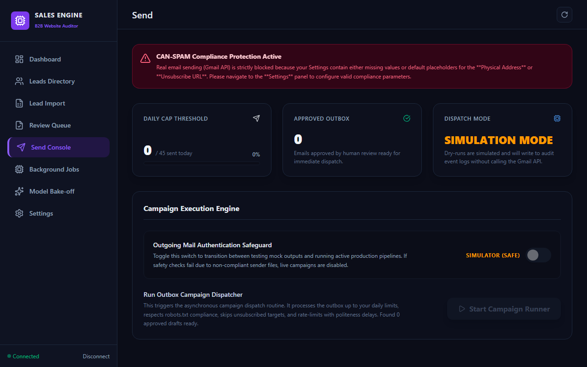
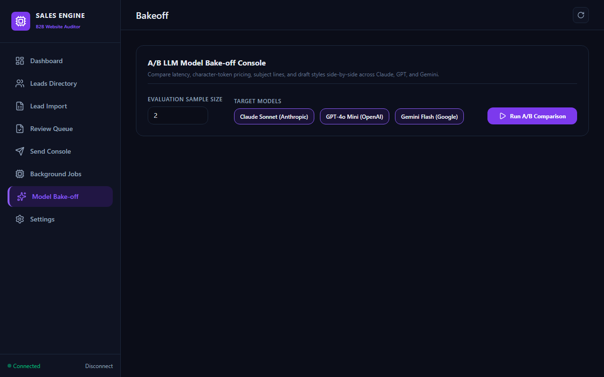

# Website-Audit Sales Automation Platform: End-to-End User Guide

This document provides a highly detailed, step-by-step guide on how to configure and use both the **React Frontend Dashboard** and the **Terminal Command Line Interface (CLI)** to run B2B outreach campaigns. It includes screenshots of the actual running application to help you navigate each screen with ease.

---

## Table of Contents
1. [Initial Preparation & Prerequisites](#1-initial-preparation--prerequisites)
2. [Step-by-Step Guide: Importing Leads (CSV Ingestion)](#2-step-by-step-guide-importing-leads-csv-ingestion)
3. [Step-by-Step Guide: Scraping & Auditing (Playwright & PageSpeed)](#3-step-by-step-guide-scraping--auditing-playwright--pagespeed)
4. [Step-by-Step Guide: Email Drafting & Human Review](#4-step-by-step-guide-email-drafting--human-review)
5. [Step-by-Step Guide: Dispatching Campaigns (Send Console)](#5-step-by-step-guide-dispatching-campaigns-send-console)
6. [Step-by-Step Guide: A/B Model Comparisons (Bake-Off Console)](#6-step-by-step-guide-ab-model-comparisons-bake-off-console)
7. [The Automated End-to-End Execution Flow](#7-the-automated-end-to-end-execution-flow)
8. [Compliance & Safety Safeguards](#8-compliance--safety-safeguards)

---

## 1. Initial Preparation & Prerequisites

To run the application, ensure your environment is set up:
1. **Virtual Environment & Dependencies:**
   * Activate your virtual env: `.venv\Scripts\activate` (Windows) or `source .venv/bin/activate` (Mac/Linux).
   * Install python packages: `pip install -r requirements.txt`.
   * Install crawler binaries: `playwright install chromium`.
2. **Environment Variables:** Define keys inside your `.env` file (e.g. `API_AUTH_TOKEN=test-token`). For instructions on Google PageSpeed, OpenAI, Gemini, or Anthropic Claude API keys, read the [API Keys Setup Guide](api_keys_guide.md).
3. **Run Dev Servers:**
   * **Backend:** `.venv\Scripts\uvicorn src.api.main:app --host 127.0.0.1 --port 8000`
   * **Frontend:** `cd frontend && npm run dev`
   * Navigate to `http://localhost:5173` and authenticate using your `API_AUTH_TOKEN`.

---

## 2. Step-by-Step Guide: Importing Leads (CSV Ingestion)

The pipeline starts by importing business targets. The app parses name, website, and target email fields while validating syntax, skipping duplicates, and blacklisting opted-out recipients.

### CSV Layout Example
Your CSV file should have a clean tabular format. Common column headers are auto-detected, but you can map custom headers on the import page.
```csv
Company Name,Website URL,Email Address,Contact Person
Acme Corp,https://acme.com,info@acme.com,John Doe
Beta Agency,beta-agency.net,contact@beta-agency.net,Jane Smith
```

### Ingestion Walkthrough
1. Select **Lead Import** from the sidebar navigation.
2. Drag and drop your `.csv` file into the upload zone or click to browse.
3. Once loaded, the **CSV Preview Table** renders the first 3 rows of your CSV file so you can check formatting.
4. Use the dropdown boxes under **Map CSV Columns** to match your file columns with:
   * **Company Name** (Required)
   * **Website URL** (Required)
   * **Target Email** (Required)
   * **Contact Name** (Optional)
5. Click **Import Leads**. The background worker will run validation routines:
   * Cleans and normalizes URLs (e.g., stripping `www.` and appending `https://`).
   * Verifies syntax validity.
   * Compares domains/emails against the **Suppression List** (marking matches as `suppressed`).
   * Skips duplicates already existing in the database.
6. The UI will redirect you to the **Leads Directory** or **Background Jobs** tab to view ingestion counts.



---

## 3. Step-by-Step Guide: Scraping & Auditing (Playwright & PageSpeed)

Once leads are imported, they enter the `imported` state and are ready for web audits.

### Step 1: Website Scraping (Playwright Crawler)
1. Trigger the scraper by navigating to the **Background Jobs** tab, select `scrape` from the job type list, and click **Launch Job**.
   * *CLI Alternative:* `.venv\Scripts\python -m src.main scrape`
2. **Under the Hood (Automated):**
   * The scraper checks `robots.txt` compliance for each target.
   * It spins up a headless Playwright Chromium instance.
   * It scans the homepage and crawls internal links containing B2B keywords (e.g. `about`, `services`, `contact`, `pricing`) up to configuration depth.
   * It takes a full-screen desktop screenshot saved to `data/screenshots/`.
   * Concatenated text contents are saved into the database, and the status changes to `scraped`.

### Step 2: Running Audits & Signal Mapping (Analysis)
1. Launch an `analyze` job from the **Background Jobs** tab.
   * *CLI Alternative:* `.venv\Scripts\python -m src.main analyze`
2. **Under the Hood (Automated):**
   * The analyzer inspects the homepage HTML for specific elements: missing title/description tags, viewport responsiveness, missing contact forms, and absence of analytics trackers (Google Analytics/Tag Manager/Facebook Pixel).
   * It queries Google's **PageSpeed Insights API** (if configured, or falls back to simulated scores) to gather core metrics: Performance, Accessibility, Best Practices, and SEO.
   * It conducts concurrent broken-link verification across crawled internal hyperlinks.
   * Based on weaknesses, it maps leads to concrete sold services (e.g. CRM Integration, Full-Stack Design, SEO, Analytics setup) sorted by severity and saves them as database findings.
   * Lead status shifts to `analyzed`. Leads with zero detected findings are skipped (`skipped_no_findings`).

To view results, navigate to **Leads Directory**, click a lead row, and review the slide-out **Inspector Panel** displaying screenshots, scores, and specific mapped findings.



---

## 4. Step-by-Step Guide: Email Drafting & Human Review

With objective website weaknesses mapped, the LLM constructs outreach drafts.

### Step 1: Email Generation
1. Launch a `generate` job from the **Background Jobs** tab.
   * *CLI Alternative:* `.venv\Scripts\python -m src.main generate`
2. **Under the Hood (Automated):**
   * The generator loads configurations and LLM temperature rules.
   * It formats prompt context linking lead metadata, page speed results, and mapped findings, forcing the model to cite only verified audit findings.
   * **Grounding Validator:** Passes the written draft to a separate deterministic LLM auditor to compare citations against database findings. Re-generates drafts if they mention hallucinated claims (e.g. referencing SSL errors when SSL is valid).
   * Appends deterministic, CAN-SPAM compliant footers (sender information, company address, and unsubscribe link) and updates status to `drafted`.

### Step 2: Interactive Human-in-the-Loop Review
To ensure email quality before dispatching, drafts must go through review:
1. Navigate to the **Review Queue** tab.
2. Select a lead from the left sidebar to load the **two-pane workspace**:
   * **Left Sidebar:** Filterable list of all prospects currently in `drafted` status.
   * **Main Pane:** Displays lead detail telemetry, page speed indicators, crawled subpage links, and the email editor.
3. Review the subject and body. You can edit the text blocks directly.
4. Choose the appropriate action:
   * **Approve:** Moves lead/email status to `approved`, staging it for sending.
   * **Reject:** Prompts you to enter a feedback reason, archiving the lead as `rejected`.
   * **Skip:** Bypasses the lead for later review.
   * *Keyboard Shortcuts:* Press `A` to Approve, `R` to Reject, and `S` to Skip.



---

## 5. Step-by-Step Guide: Dispatching Campaigns (Send Console)

The **Send Console** acts as the campaign cockpit, managing dispatch speed, dry-run simulation states, and providing live execution logs.

### Campaign Dispatch Walkthrough
1. Navigate to the **Send Console** tab.
2. Review the following widgets:
   * **Today's Sends Gauge:** A circular indicator measuring the number of emails sent today against the configured daily sending limit cap (defaults to a safe throttle of 30 sends/day).
   * **Simulator Mode Toggle:** Switch choosing between simulated runs (mock sends written to database logs without emailing clients) and live Gmail API dispatches.
   * **Compliance Alert:** Warns if `physical_address` or `unsubscribe_base_url` settings in `config.yaml` contain default placeholder values. Live Mode remains disabled until these fields are customized.
3. Click **Start Sending Job**.
4. **SSE Live Terminal Console:** Watch the console box stream real-time logs directly from the backend worker showing:
   * Pre-send compliance validations.
   * Suppression list double-checks.
   * Inter-message politeness delays.
   * Delivery success confirmations.



---

## 6. Step-by-Step Guide: A/B Model Comparisons (Bake-Off Console)

Compare outputs from different LLM providers (Anthropic Claude, OpenAI GPT, Google Gemini) side-by-side:
1. Navigate to the **Model Bake-off** tab.
2. Set a **Lead Sample Size** and toggle which model providers to test.
3. Click **Execute Comparison**.
4. The dashboard queries all selected models simultaneously and displays results in a comparative columns grid:
   * Details character counts, estimated API token costs, and generation latency (in seconds).
   * Visual indicators identify the **Fastest** and **Cheapest** drafts.
   * Previews the draft subject and body text generated by each LLM.



---

## 7. The Automated End-to-End Execution Flow

To run the entire pipeline without clicking through individual pages in the web dashboard, you can trigger automated scripts.

### How the Automated Flow Works
The automation scripts orchestrate the pipeline stages in sequence:
1. **Virtual Environment Activation:** Detects and activates the local `.venv`.
2. **Web Crawling:** Executes Playwright scraping on all leads in `pending` status.
3. **HTML & PageSpeed Auditing:** Runs local inspections and queries Lighthouse API metrics, mapping findings to sold services.
4. **LLM Writing & Grounding:** Generates cold email outreach copies and filters out drafts failing grounding audits.
5. **Campaign Delivery:** Initiates the sending queue, distributing emails while respecting suppression blacklists and daily limit throttles.

### Running the Automated Script
At the root of the project, run the script for your environment:

#### Windows PowerShell:
```powershell
# Run automatically in Simulator (dry-run) mode for up to 5 leads
.\run_pipeline.ps1 -Limit 5 -DryRun $true

# Run live campaigns (make sure your .env and Gmail OAuth are configured)
.\run_pipeline.ps1 -Limit 10 -DryRun $false
```

#### Unix / macOS Bash:
```bash
# Set script permissions
chmod +x run_pipeline.sh

# Run automatically in Simulator (dry-run) mode
./run_pipeline.sh --limit 5 --dry-run

# Run live campaigns
./run_pipeline.sh --limit 10 --real-run
```

---

## 8. Compliance & Safety Safeguards

To maintain a healthy domain sending reputation, the application enforces the following rules:
* **Simulator Lockout:** If `email.physical_address` or `email.unsubscribe_base_url` are left as placeholders (`123 Main St` or `localhost`), the system locks the dispatcher into simulator-only mode.
* **Suppression Blacklist:** If an imported lead matches a blacklisted domain or email address in the Suppression table, its status is immediately set to `suppressed`, bypassing crawler, generator, and sending scripts.
* **Daily Caps:** Sending jobs halt immediately once the maximum daily cap is hit (30 sends/day by default), protecting your address from spam filters.
